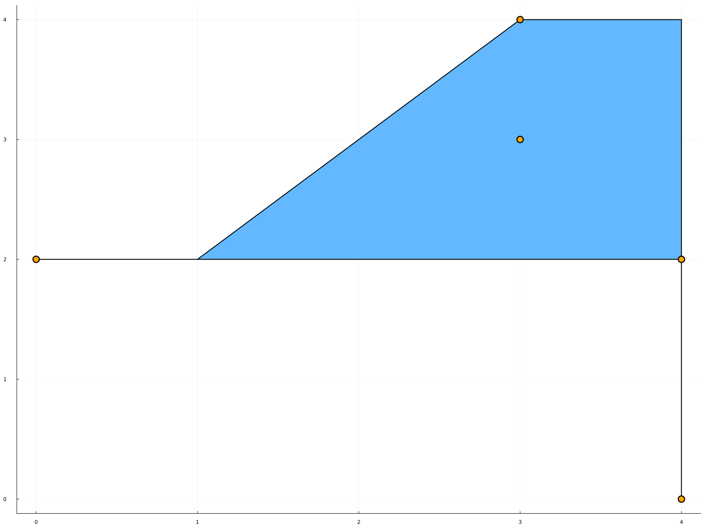

# Using TPLib

```@setup example
using TPLib
```

```@meta
DocTestSetup = quote
    using TPLib
end
```

## Representing tropical numbers

Tropical elements are represented as the type `MaxPlus{T}` or `MinPlus{T}` where `{T <: Number}` depending on wether they are elements of the max-plus semiring ``(\mathbb{R} \cup \{-\infty\},\max{},+)`` or the min-plus semiring ``(\mathbb{R} \cup \{+\infty\},\min{},+)``. The types `MaxPlus{T}` and `MinPlus{T}` are both subtypes of `SemiRing{T}`. They contain a field accessible through the function [`elt`](@ref) which is either an element of `T`, or an element of type `Infinite` representing the tropical zero. This element is denoted `∞` in both tropical semirings, and is displayed `·` in the REPL. The function [`isinfinite(x)`](@ref) returns `true` if `x` is the tropical zero of the field.

Tropical elements are constructed either by providing explicitely the type [`MaxPlus{T}(x)`](@ref) or [`MinPlus{T}(x)`](@ref), in which case `x` is converted to type `T` or to `∞` (the latter is done even if `x` is an infinite element which cannot be converted to type `T`, for instance `MaxPlus{Int64}(-Inf)`), or simply with [`MaxPlus(x)`](@ref) or [`MinPlus(x)`](@ref), in which case `T` is inferred from the type of `x`.

```jldoctest
julia> MaxPlus(4.)
4.0
julia> MinPlus{Rational}(5)
5//1
julia> MaxPlus{Int64}(-Inf) == MaxPlus{Int64}(∞)
true
```

Addition [`+`](@ref) and multiplication [`*`](@ref) of elements of type `SemiRing{T}` are the tropical operations `max/min` and `+` respectively. Conversion between elements of type `SemiRing{T}` and of type `T` or `Infinite` is done automatically. 

```jldoctest
julia> MaxPlus(4.) + MaxPlus(-6)
4.0
julia> MinPlus(6.) * 4
10.0
julia> MaxPlus(8//3) * -Inf == MaxPlus{Rational}(∞)
true
```

The rest of the guide will use mostly the max-plus semiring. The arguments of all functions can be arrays of type `SemiRing{T}`, in which case the tropical operation `+` will be infered from the type of the semiring, or can be arrays of type `T<:Number`. In this case, an additional argument can be given, either `:max` or `:min`, to specify if the conversion should be done towards `MaxPlus{T}` or `MinPlus{T}`. Otherwise, it defaults to `:max`.

```@repl example
I = [3 ∞ 5 4 2 ∞]
compute_ext_rays(I,3)
compute_ext_rays(I,3,:min)
compute_ext_rays(convert(Matrix{MaxPlus{Int64}},I),3)
```

You could also write `-Inf` instead of `∞` in `I` for the max-plus ring, or `Inf` for the min-plus ring. This however would change the type of `I` to `Matrix{Float64}`, and therefore the result would be of type `Matrix{MaxPlus{Float64}}` instead of `Matrix{MaxPlus{Int64}}`.

```@repl example
I = [3 -Inf 5 4 2 -Inf]
compute_ext_rays(I,3)
```

To prevent this, you can convert beforehand the matrix `I` to the type `Matrix{MaxPlus{Int64}}`. The `-Inf` will be converted to `∞`.

```@repl example
convert(Matrix{MaxPlus{Int64}}, I)
```

## Compute rays of a tropical cone


Given a tropical cone in ``\mathbb{T}^n`` described by the inequalities  ``\max(a_{i1} + x_1, \dots, a_{in} + x_n) \geqslant \max(b_{i1} + x_1, \dots, b_{in} + x_n)`` for ``i \in [m]`` regrouped in the matrix `I` with `m` rows and `2n`columns, the function [`compute_ext_rays(I,n)`](@ref) returns a matrix `G` whose rows are the minimal family of generators of the cone. For example, consider the cone in ``\mathbb{T}^5`` defined by the inequalities

```math
\max(x_2 + 2, x_3 - 1, x_4 + 4) \geqslant \max(x_1 + 2, x_2 + 2, x_4 + 4, x_5 + 2) \\
\max(x_1 + 1, x_3 + 4, x_4 + 5, x_5 + 4) \geqslant \max(x_2 + 4, x_4 + 5, x_5 + 4)
```

Then the matrix representation of the system and the computation are as follows:

```@repl example
I = [∞ 2 -1 4 ∞ 2 2 ∞ 4 2;
    1 ∞ 4 5 4 ∞ 4 ∞ 5 4]
compute_ext_rays(I,5)
```

## Compute rays of the tropical polar cone

Specifying a cone by a set of generators `M` in dimension `n`, the function [`compute_ext_rays_polar(M,n)`](@ref) returns the generators of the tropical polar cone. For example, consider the cone in ``\mathbb{T}^5`` which is the tropical cone generated by

```math
\operatorname{tcone}(v_1, v_2, v_3) \\
```

```math
\text{where } v_1 = \begin{pmatrix} -\infty \\ 4 \\ 2 \\ 3 \\ 4 \end{pmatrix}, v_2 = \begin{pmatrix} 4 \\ -\infty \\ -5 \\ 4 \\ -1 \end{pmatrix}, v_3 = \begin{pmatrix} -\infty \\ -\infty \\ 2 \\ 3 \\ -1 \end{pmatrix}
```

The generators are represented as the matrix

```@repl example
M = [∞ 4 2 3 4; 4 ∞ -5 4 -1; ∞ ∞ 2 3 -1]
compute_ext_rays_polar(M,5)
```

Because of the absence of a minus operation for tropical numbers, the polar of a cone in ``\mathbb{T}^n`` lies in ``\mathbb{T}^{2n}``, therefore the output of the function is a matrix with `2n` columns.

As another example, we can compute a minimal family of generators of a tropical cone by computing generators of the tropical polar cone, which are equations for the halfspaces defining the tropical cone, and then computing the rays of the tropical cone using these equations. For example, consider the tropical cone in ``\mathbb{T}^3`` defined by the generators

```math
\operatorname{tcone}(v_1, v_2, v_3, v_4, v_5)
```

```math
\text{where } v_1 = \begin{pmatrix} 0 \\ 4 \\ 0 \end{pmatrix}, \, v_2 = \begin{pmatrix} 0 \\ 3 \\ 4 \end{pmatrix} , \, v_3 = \begin{pmatrix} 0 \\ 0 \\ 2 \end{pmatrix} , \, v_4 = \begin{pmatrix} 0 \\ 4 \\ 2 \end{pmatrix} , \, v_5 = \begin{pmatrix} 0 \\ 3 \\ 3 \end{pmatrix} .
```

Drawing the projection of the tropical cone in ``\mathbb{P}^2``, we clearly see that it is equal to ``\operatorname{tcone}(v_1, v_2, v_3)``.



Indeed, we have the computation

```@repl example
M = [0 4 0; 0 3 4; 0 0 2; 0 4 2; 0 3 3]
compute_ext_rays(compute_ext_rays_polar(M,3),3)
```

## Compute halfspaces

Given a tropical cone defined by a generating set `M` in dimension `n`, [`compute_halfspaces(M,n)`](@ref) returns a representation of the cone by means of sectors of halfspaces. A halfspace give by the row ``[h_{i1}, \dots, h_{in}]`` and the set of sectors ``J`` is the subset defined by the inequality

```math
 \max_{j \in J}(x_j - h_{ij}) \geqslant \max_{j \in [n] \setminus J}(x_j - h_{ij})
```

The point ``(h_{i1}, \dots, h_{in})`` is called the apex of the the halfspace. Considering the same tropical cone as the previous example with its minimal family of generators,

```math
\operatorname{tcone}(v_1, v_2, v_3)
```

```math
\text{where } v_1 = \begin{pmatrix} 0 \\ 4 \\ 0 \end{pmatrix}, \, v_2 = \begin{pmatrix} 0 \\ 3 \\ 4 \end{pmatrix} , \, v_3 = \begin{pmatrix} 0 \\ 0 \\ 2 \end{pmatrix} .
```

From the drawing above, we see that the tropical polytope is defined by five halfspaces, with apexes ``(0,0,2)``, ``(0,1,2)``, ``(0,4,4)``, ``(0,4,2)``, and ``(0,4,0)``. Indeed, the compuation gives

```@repl example
M = [0 4 0; 0 3 4; 0 0 2]
show(stdout, "text/plain", compute_halfspaces(M,3))
```

## Compute tropical complex

Given a tropical cone defined by a generating set `M` in dimension `n`, [`compute_tropical_complex(M,n)`](@ref) returns the tropical complex associated with the tropical cone, meaning a set of vertices and a set of maximal cells defined by their adjacency with the vertices. These cells give a decomposition of the tropical polytope in a polyhedral complex.

Returning to our example

```math
\operatorname{tcone}(v_1, v_2, v_3)
```

```math
\text{where } v_1 = \begin{pmatrix} 0 \\ 4 \\ 0 \end{pmatrix}, \, v_2 = \begin{pmatrix} 0 \\ 3 \\ 4 \end{pmatrix} , \, v_3 = \begin{pmatrix} 0 \\ 0 \\ 2 \end{pmatrix} .
```

this tropical cone can be decomposed in three maximal cells, the full dimensional one whose vertices are ``(0,1,2)``, ``(0,3,4)``, ``(0,4,4)``, and ``(0,4,2)``, as well as the two segments joining ``(0,0,2)`` to ``(0,1,2)`` and ``(0,4,0)`` to ``(0,4,2)``. The computation yields


```@repl example
M = [0 4 0; 0 3 4; 0 0 2]
show(stdout, "text/plain", compute_tropical_complex(M,3))
```

Here is a more complex example. On the figure, the orange vertices are the tropical vertices of the tropical polytope. They form, along with the red vertices, the vertices of the polyhedral complex.

```@repl example
M = [0 24 95; 0 41 -9; 0 56 27; 0 64 50; 0 10 -67; 0 -17 -16; 0 -23 44]
show(stdout, "text/plain", compute_tropical_complex(M,3))
```


## Compute tangent hypergraph

The tangent hypergraph of a tropical cone in dimension `n` at point `P` can be computed using the function [`compute_tangent_hypergraph`](@ref). If the tropical cone is defined by a system of inequalities `I` or by generators `M`, then the usage is

```@julia
compute_tangent_hypergraph(I,P,n)
compute_tangent_hypergraph(M,P,n)
```

If the cone is defined by a a system of halfspaces `H` and their sectors `A`, then the usage is

```@julia
compute_tangent_hypergraph(H,A,P,n)
```

The function returns a tuple containing the number of vertices of the hypergraph, its hyperedges, and in the case where it is called with inequalities or halfspaces, then it also returns the inequalities or halfspaces associated with each halfspace.

```@repl example
H = [0 1 4 8; 0 3 6 10; 0 3 7 11; 0 3 7 11; 0 4 8 12; 0 1 5 9; 0 1 2 6; 0 1 2 3; 0 1 3 5; 0 1 2 4; 0 1 2 4; 0 1 3 7; 0 2 4 7; 0 2 5 9; 0 1 3 6]
A = [[2, 4], [1, 4], [1, 3], [1, 4], [1], [2], [3], [4], [1, 4], [1, 4], [2, 4], [1, 3], [1, 4], [1, 3], [2, 4]]
P = [0, 2, 5, 8]
show(stdout, "text/plain", compute_tangent_hypergraph(H,A,P,4))
```

```@repl example
I = [-Inf 0 -Inf 1 -Inf -Inf; -Inf -4 -3 0 -Inf -Inf; -Inf -Inf -1 0 -6 -Inf; 0 -Inf -Inf -Inf -Inf -4; 0 -8 -Inf -Inf -Inf -3]
P = [0, 1, 3]
show(stdout, "text/plain", compute_tangent_hypergraph(I,P,3))
```

```@repl example
M =  [0 1 3; 0 4 1; 0 9 4]
P = [0, 1, 3]
show(stdout, "text/plain", compute_tangent_hypergraph(M,P,3))
```

## References

The algorithms implemented in TPLib are bases on the following papers.

[1] X. Allamigeon. Static analysis of memory manipulations by abstract interpretation -- Algorithmics of tropical polyhedra, and application to abstract interpretation. PhD thesis. 

[2] X. Allamigeon, S. Gaubert, E. Goubault. Computing the vertices of tropical polyhedra using directed hypergraphs. Discrete & Computational Geometry, 49(2):247–279, 2013. E-print arXiv:0904.3436v4.

[3] X. Allamigeon, S. Gaubert, and R. D. Katz. Tropical polar cones, hypergraph transversals, and mean payoff games. Linear Algebra Appl., 435(7):1549–1574, 2011. E-print arXiv:1004.2778.

[4] X. Allamigeon and R.D. Katz. Minimal external representations of tropical polyhedra. Journal of Combinatorial Theory, Series A, 120(4):907–940, 2013.  Eprint arXiv:1205.6314.

[5] X. Allamigeon, S. Gaubert, E. Goubault. Inferring Min and Max Invariants Using Max-plus Polyhedra. Proceedings of the 15th International Static Analysis Symposium (SAS'08). 

[6] M. Develin and B. Sturmfels. Tropical convexity. Doc. Math., 9:1–27 (electronic), 2004. E-print arXiv:math.MG/0308254.
